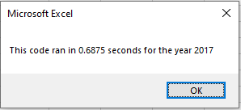
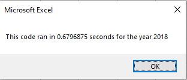
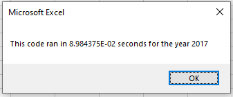
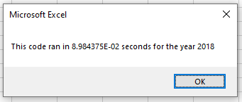

# VBA-Challenge (stock-analysis)

## Overview
Our first goal with this project was to use VBA to analyze a small selection of stocks from the years 2017 and 2018. During our analyzation our goal was to determine the total volume for the year as well as the percentage return a given stock had for the year.

The second goal we had, was to take what we learned with the first goal, and apply that towards refactoring the code to make it run more efficiently.

## Results

#### Time to run function prior to refactor

#### Time to run function after refactor

## Summary
As one can tell from the above images, the refactored function is significantly faster then it was prior to being refactored. In order to ensure that this finding is accurate we will be creating a list of the pros and cons of each.

### Pros and Cons of refactored code

Pros | *Cons*
--- | ---
**Runs much faster** | *Time it takes to refactor*
**Avoids nested for loops** | *Both solutions struggle to scale*

Ultimately the refactored version of the code lacks any cons that would keep the old code relevant. Both versions of the code share the same major weakness, which is that neither will scale easily. Both would require substantial reworks if any addtional tickers got added into the dataset, however in theory they should handle additional years fine. If we were to move foward with rectifying this my primary idea would be to loop through the ticker column on each data page and store each unique ticker in the tickers list. This change would remove most, if not all, of the hard-coded values in the function and make the entire function more dynamic and re-usable.
